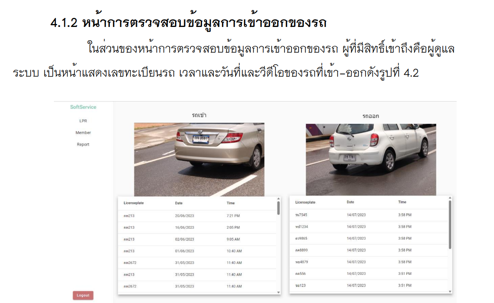
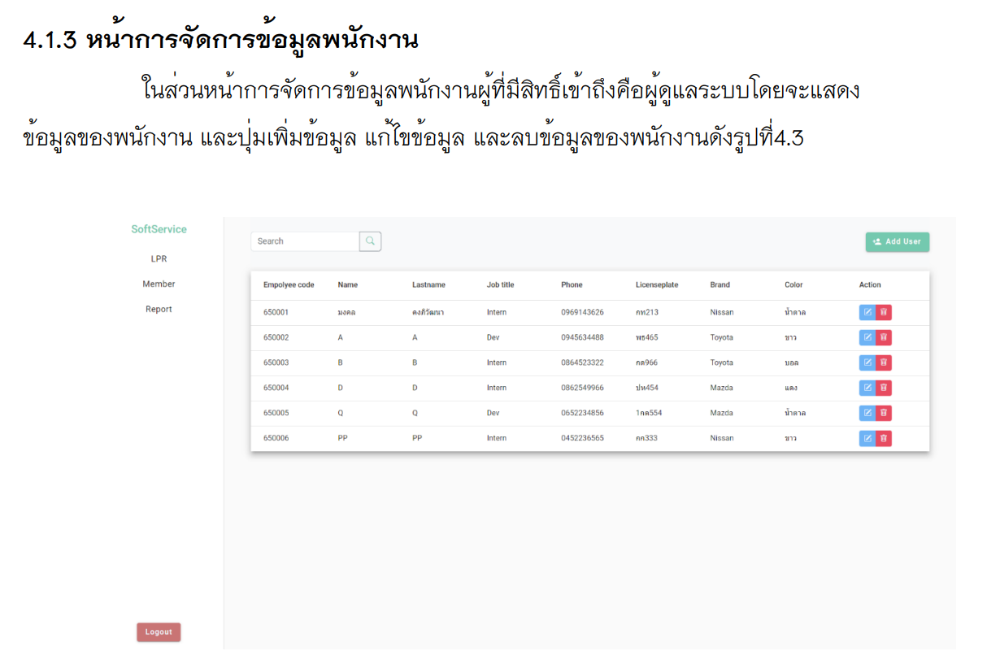
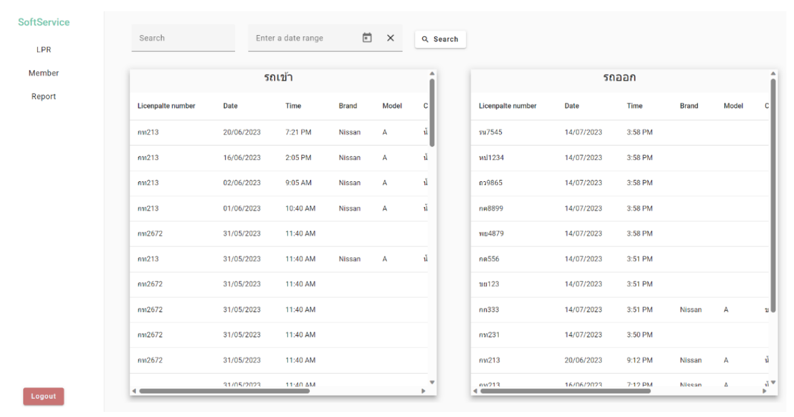
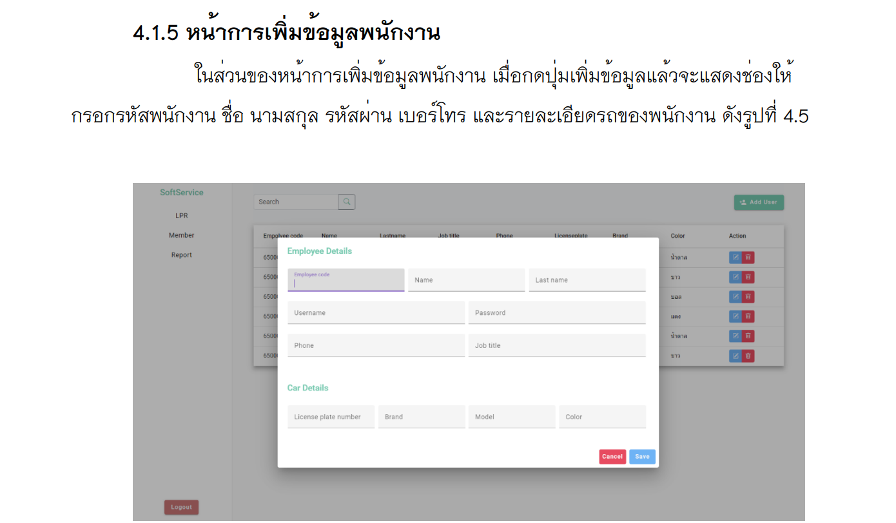
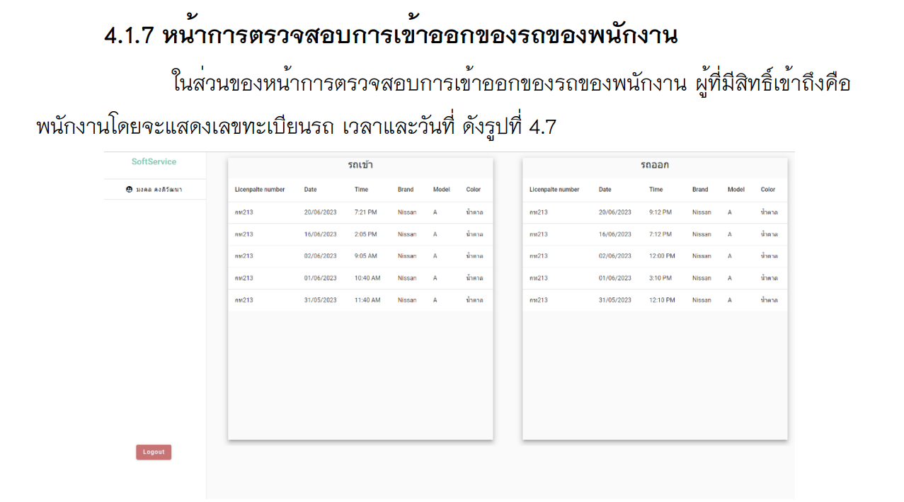
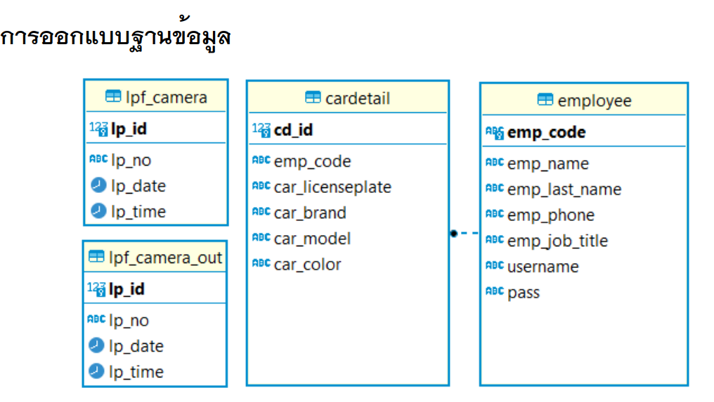
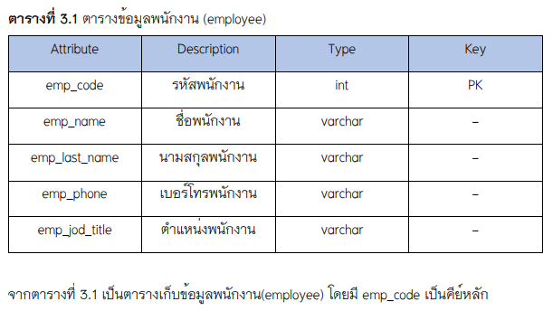
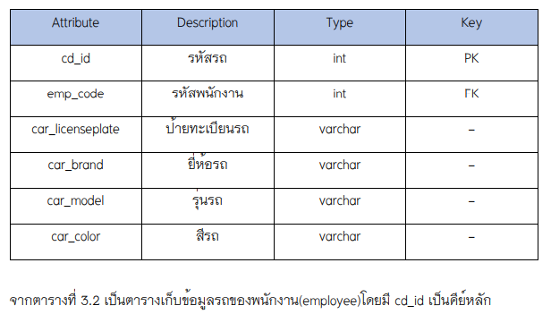
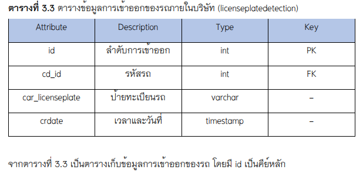

# WebMaterial

This project was generated with [Angular CLI](https://github.com/angular/angular-cli) version 16.1.1.

## รายละเอียดเกี่ยวกับโปรเจกต์
โปรเจกต์นี้เป็นส่วนหนึ่งของปริญญานิพนธ์ตามหลักสูตรวิศวกรรมศาสตร์บัณทิต

## เทคโนโลยีที่ใช้
Frontend Angular material
Backend Java Spring Boot
Database PostgresSQL (โดยใช้ docker สร้างด้วย image Postgres)
โดยโปรเจกต์นี้ ไม่ได้มีการทำ Security และ Authentication และไม่ได้ Deploy

### เว็บไซต์แสดงระบบตรวจจับทะเบียนรถ
โดย repository เป็นส่วนของ frontend

